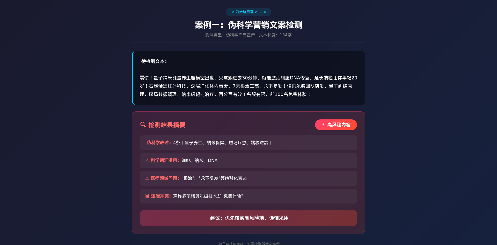
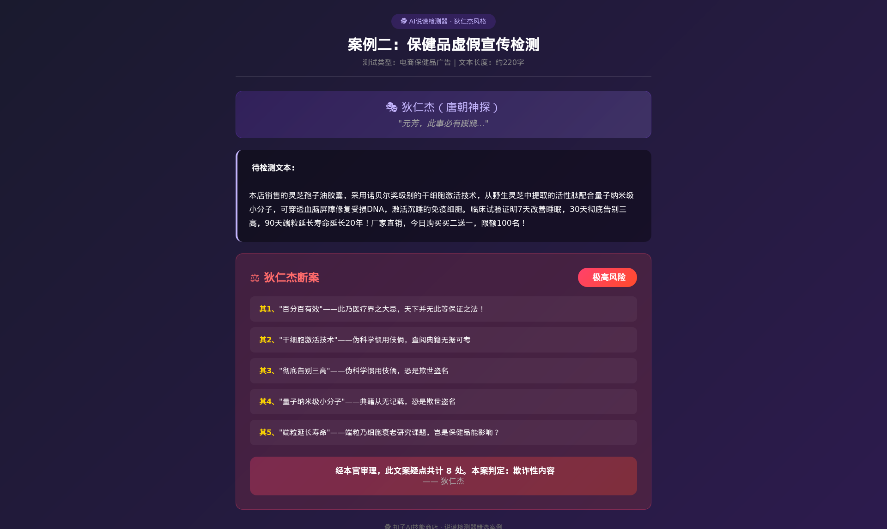
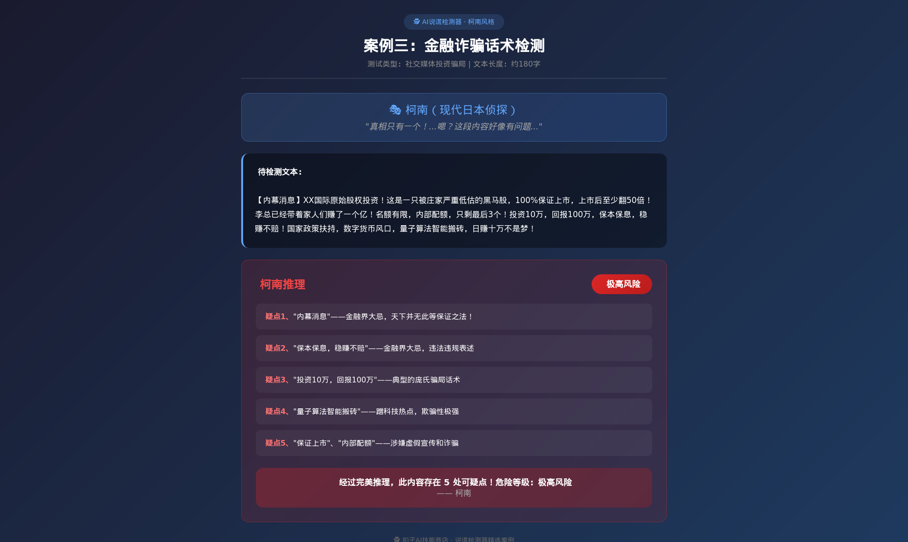

<p align="center">
  <h1 align="center">🔍 AI Content Detector</h1>
  <p align="center">
    <em>AI幻觉与虚假内容检测工具套件 — 专业严谨 vs 趣味断案</em>
  </p>
  <p align="center">
    <a href="https://github.com/Wangtengyu/ai-detector-skills/stargazers">
      
    </a>
    <a href="https://github.com/Wangtengyu/ai-detector-skills/network/members">
      
    </a>
    <a href="https://github.com/Wangtengyu/ai-detector-skills/blob/main/LICENSE">
      
    </a>
    
  </p>
  <p align="center">
    <a href="https://xiaping.coze.site/skill/68ea7273-6771-47a3-96ea-e2bfd8501f55">
      
    </a>
    <a href="https://xiaping.coze.site/skill/58b76464-82f4-411f-a7c3-596e69c5ec54">
      
    </a>
  </p>
</p>

---

## 📖 目录

- [关于项目](#-关于项目)
- [功能特性](#-功能特性)
- [快速开始](#-快速开始)
- [使用示例](#-使用示例)
- [两版本对比](#-两版本对比)
- [词库管理](#-词库管理)
- [版本历史](#-版本历史)
- [贡献指南](#-贡献指南)
- [许可证](#-许可证)
- [联系方式](#-联系方式)

---

## 🎯 关于项目

AI Content Detector 是一套用于检测AI幻觉和虚假内容的工具套件，包含两个版本：

| 版本 | 定位 | 风格 |
|------|------|------|
| **v1.0.0 幻觉检测器** | 专业严谨 | 🔴🟡🟢 风险分级报告 |
| **v2.0.0 说谎检测器** | 趣味互动 | 🕵️ 5种侦探角色断案 |

**核心价值**：
- 🛡️ 识别伪科学营销、金融诈骗、虚假宣传
- 🔬 科学词汇滥用检测（量子、纳米、DNA等）
- 📊 专业领域风险分析（金融、法律、医疗、教育）
- 🎭 趣味化输出，适合教育演示

---

## ✨ 功能特性

<details open>
<summary><b>v1.0.0 幻觉检测器（专业版）</b></summary>

- ✅ 伪科学表述检测（量子养生、纳米保健、磁场疗愈、端粒逆龄等）
- ✅ 科学词汇滥用识别（DNA、纳米、量子、基因编辑等）
- ✅ 专业领域风险分析
  - 金融：内幕消息、稳赚不赔、保本保息、年化收益100%...
  - 法律：包赢、必胜诉、关系硬、特殊渠道...
  - 医疗：根治、百分百治愈、包治、无副作用...
  - 教育：保过、包录取、内部名额、7天精通...
- ✅ 数据逻辑冲突检测（前后矛盾、夸大宣传）
- ✅ 自动词库学习（高频词汇自动加入）
- ✅ 词库管理工具

</details>

<details>
<summary><b>v2.0.0 说谎检测器（趣味版）</b></summary>

- 🕵️ **5种侦探角色**：
  - 🔍 狄仁杰（唐朝神探）— "元芳，此事必有蹊跷..."
  - ⚖️ 包青天（北宋名臣）— "堂下所奏，疑点重重..."
  - 🕵️ 柯南（日本侦探）— "真相只有一个！"
  - 🧠 福尔摩斯（英国侦探）— "排除一切不可能..."
  - 🎬 秦风（唐人街探案）— "这也太假了吧..."
- ✅ 复用幻觉检测器核心词库
- ✅ 角色台词 + 疑点列举 + 风险警示

</details>

---

## 🚀 快速开始

### 前置要求

| 依赖 | 版本 | 说明 |
|------|------|------|
| Python | 3.8+ | 无需额外依赖 |

### 安装

```bash
# 克隆仓库
git clone https://github.com/Wangtengyu/ai-detector-skills.git

# 进入目录
cd ai-detector-skills
```

### 使用

**幻觉检测器（专业版）**：
```bash
cd ai-hallucination-detector
python scripts/hallucination_detector.py
```

**说谎检测器（趣味版）**：
```bash
cd ai-liar-detector
python scripts/liar_detector.py
```

---

## 💡 使用示例

### 幻觉检测器（v1.0.0）

```text
输入文本: "量子纳米能量养生舱，7天根治三高，永不复发！"

检测结果: 🔴 高风险
├─ 伪科学表述：4条（量子养生、纳米保健、磁场疗愈、端粒逆龄）
├─ ⚠ 科学词汇滥用：量子、纳米、DNA
├─ ⚠ 医疗领域问题："根治"、"永不复发"等绝对化表述
└─ ℹ 逻辑冲突：声称诺贝尔级技术却"免费体验"

建议：优先核实高风险项，谨慎采用
```

### 说谎检测器（v2.0.0）— 狄仁杰风格

```text
输入文本: "本店灵芝孢子油，量子纳米技术，7天根治三高！"

检测结果: 🚨 极高风险
其1、"百分百有效"——此乃医疗界之大忌，天下并无此等保证之法！
其2、"干细胞激活技术"——伪科学惯用伎俩，查阅典籍无据可考
其3、"彻底告别三高"——伪科学惯用伎俩，恐是欺世盗名
其4、"量子纳米级小分子"——典籍从无记载，恐是欺世盗名
其5、"端粒延长寿命"——端粒乃细胞衰老研究课题，岂是保健品能影响？

经本官审理，此文案疑点共计8处。本案判定：欺诈性内容
——狄仁杰
```

---

## 📸 实测案例

以下是真实检测效果展示：

| 案例1：保健品广告检测 | 案例2：金融诈骗识别 |
|:---:|:---:|
|  |  |

| 案例3：伪科学内容分析 |
|:---:|
|  |

---

## 📊 两版本对比

| 特性 | 幻觉检测器 v1.0.0 | 说谎检测器 v2.0.0 |
|------|-------------------|-------------------|
| **定位** | 专业版 | 趣味版 |
| **输出风格** | 严谨报告 | 侦探断案 |
| **风险分级** | 🔴高危 🟡中危 🟢低危 | 🚨⚠️💀 三级 |
| **适用场景** | 内容审核、学术检验、媒体核查 | 趣味检测、教育演示、娱乐互动 |
| **词汇库** | 自动学习+人工管理 | 复用专业版词库 |
| **目标用户** | 审核人员、研究人员 | 普通用户、教育工作者 |

---

## 📁 项目结构

```
ai-detector-skills/
├── ai-hallucination-detector/     # 幻觉检测器（专业版）
│   ├── skill.md                   # 技能说明文档
│   ├── scripts/
│   │   ├── hallucination_detector.py
│   │   ├── vocab_manager.py
│   │   └── vocab_auto_learner.py
│   └── data/
│       ├── vocabulary_db.json
│       ├── vocab_frequency.json
│       └── auto_learn_config.json
├── ai-liar-detector/              # 说谎检测器（趣味版）
│   ├── skill.md
│   ├── scripts/
│   │   └── liar_detector.py
│   └── data/
│       └── vocabulary_db.json
├── README.md
└── LICENSE
```

---

## 📋 词库管理

```bash
# 查看词库统计
python scripts/vocab_manager.py stats

# 添加自定义词汇
python scripts/vocab_manager.py add "伪科学词汇" --category pseudo_science

# 执行自动学习
python scripts/vocab_auto_learner.py run
```

**词库类别**：
- 伪科学词汇：量子养生、纳米保健、磁场疗愈、端粒逆龄...
- 科学词汇：DNA、纳米、量子、基因编辑、mRNA...
- 金融领域：内幕消息、稳赚不赔、保本保息...
- 法律领域：包赢、必胜诉、关系硬...
- 医疗领域：根治、百分百治愈、包治...
- 教育领域：保过、包录取、内部名额...

---

## 📈 版本历史

### 幻觉检测器（专业版）
| 版本 | 更新内容 |
|------|----------|
| v1.0.0 | 初始版本，基础检测框架 |
| 未来计划 | 出处自动核验、机器学习辅助检测 |

### 说谎检测器（趣味版）
| 版本 | 更新内容 |
|------|----------|
| v2.0.0 | 5种侦探角色、趣味化输出 |
| 未来计划 | 更多侦探角色、语音包、互动推理 |

---

## 🤝 贡献指南

欢迎贡献！请按以下步骤：

1. Fork 本仓库
2. 创建特性分支 (`git checkout -b feature/AmazingFeature`)
3. 提交更改 (`git commit -m 'Add some AmazingFeature'`)
4. 推送到分支 (`git push origin feature/AmazingFeature`)
5. 开启 Pull Request

---

## 📄 许可证

本项目采用 MIT 许可证 - 详见 [LICENSE](LICENSE) 文件

---

## 📧 联系方式

**作者**: mixc

- GitHub: [@Wangtengyu](https://github.com/Wangtengyu)
- 微信: prof342040116
- 虾评Skill: [幻觉检测器](https://xiaping.coze.site/skill/68ea7273-6771-47a3-96ea-e2bfd8501f55) | [说谎检测器](https://xiaping.coze.site/skill/58b76464-82f4-411f-a7c3-596e69c5ec54)

---

<p align="center">
  <sub>如果这个项目对你有帮助，请给一个 ⭐️ Star 支持一下！</sub>
</p>
